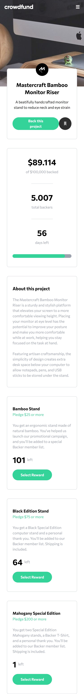

# Frontend Mentor - Crowdfunding product page solution

This is a solution to the [Crowdfunding product page challenge on Frontend Mentor](https://www.frontendmentor.io/challenges/crowdfunding-product-page-7uvcZe7ZR). Frontend Mentor challenges help you improve your coding skills by building realistic projects.

## Table of contents

- [Overview](#overview)
  - [The challenge](#the-challenge)
  - [Screenshot](#screenshot)
    - [Desktop Screenshot](#desktop)
    - [Mobile Screenshot](#mobile)
  - [Links](#links)
- [My process](#my-process)
  - [Built with](#built-with)
  - [Useful resources](#useful-resources)
- [Author](#author)

## Overview

### The challenge

Users should be able to:

- View the optimal layout depending on their device's screen size
- See hover states for interactive elements
- Make a selection of which pledge to make
- See an updated progress bar and total money raised based on their pledge total after confirming a pledge
- See the number of total backers increment by one after confirming a pledge
- Toggle whether or not the product is bookmarked

### Screenshot

#### Desktop

#### Mobile

### Links

- Solution URL : [Here](https://www.frontendmentor.io/solutions/crowdfunding-product-page-tailwind-css-and-vanilla-javascript-UfGTXPjMg)
- Live Site URL : [Here](https://jol-crowdfunding-product-page.netlify.app/)

## My process

### Built with

- Semantic HTML5 markup
- CSS custom properties
- Mobile-first workflow
- [Tailwind CSS](https://tailwindcss.com/) - CSS Framework

### Useful resources

- [W3Schools](https://www.w3schools.com)
- [Tailwind CSS](https://tailwindcss.com/)
- [Stack Overflow](https://stackoverflow.com)
- [MDN Web Docs](https://developer.mozilla.org)

## Author

- Website - [jolangker](https://jolangker.netlify.app/)
- Frontend Mentor - [@jolangker](https://www.frontendmentor.io/profile/jolangker)
- Instagram - [@thoriqqq1](https://www.instagram.com/thoriqqq1)
